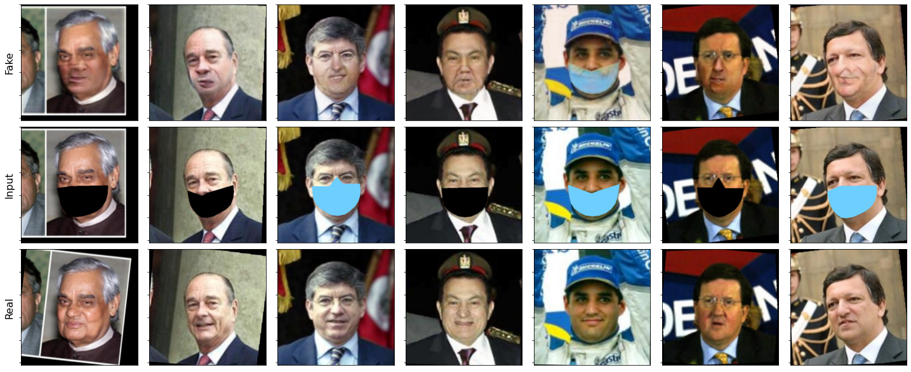
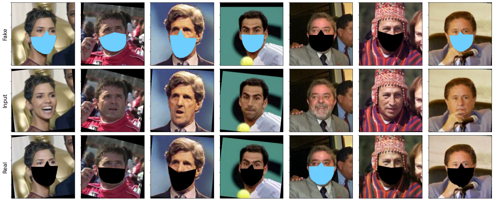

Samples of generating \textit{masked faces from naked faces} using CycleGAN. First row corresponds to the output of CycleGAN network, second row is the input 
of the Cycle-GAN, and third row is the ground-truth image.  Cycle-GAN provides good results for putting masks on naked faces. Furthermore, we notice that sometimes 
it puts masks of different color than the original one in the ground-truth image.

Samples of generating naked faces from nasked faces using CycleGAN. First row corresponds to the output of CycleGAN network, second row is the input of the Cycle-GAN, and 
third row is the ground-truth image. Cycle-GAN fails at constructing a good facial representation as illustrated in the 5th column, 
the network lowered the intensity of the mask color instead of removing it completely.

### Abstract ###
&nbsp;&nbsp;&nbsp;&nbsp;&nbsp;&nbsp; Image translation is concerned with taking one visual
representation in a domain, and transforming it into another domain, whilst maintaining similarity to the input in
the original domain. Well known examples to this include,
image colourisation, creating realistic images from edge
contours, taking horse images and converting them to zebras, changing people’s genders and alike.

&nbsp;&nbsp;&nbsp;&nbsp;&nbsp;&nbsp;    In this project, we examine a problem relevant to the pandemic, that is, adding masks to people's faces 
or removing them, and discuss state-of-the-art technique CycleGAN. Furthermore, we evaluate the performance of person identitification classifiers 
with real/fake data with/out masks. We show that CycleGAN produces well masked faces from naked faces as input, while provides poor results of naked 
faces starting from masked faces. Additionally, we show drop of classification accuracy on synthetic data generated by CycleGAN. 

#### Publications: ####
* Marouf I.E, Ümit Bora GÖKBAKAN. (2021) "Adding and Removing Masks to/from People Using GANs" [[pdf]](./paper/MAROUF_GOKBAKAN_INF634.pdf)

#### Code, Data, and Supplemental Material ####

Please download the code [GitHub](https://github.com/IemProg/LFWD_Dataset_with_Cycle-GAN).   

Please download the report [[pdf]](./paper/MAROUF_GOKBAKAN_INF634.pdf).

#### People ####
[Imad Eddine Marouf], 	imad.marouf (at) ip-paris.fr

[Ümit Bora GÖKBAKAN], 	umit.gokbakan at ip-paris.fr
